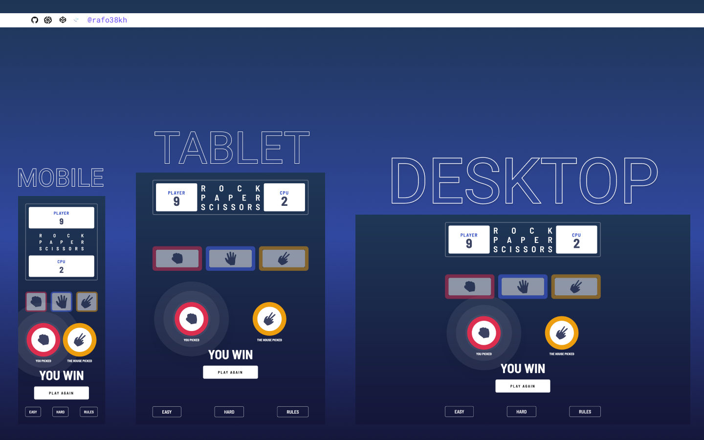

# Frontend Mentor - Rock Paper Scissors Solution

This is a solution to the [Rock Paper Scissors Challenge on Frontend Mentor](https://www.frontendmentor.io/challenges/rock-paper-scissors-game-pTgwgvgH)

## Table of contents

- [Overview](#overview)
  - [The challenge](#the-challenge)
  - [Screenshot](#screenshot)
  - [Links](#links)
- [My process](#my-process)
  - [Built with](#built-with)
- [Author](#author)

## Overview

### The challenge

- View the optimal layout for the game depending on their device's screen size
- Play Rock, Paper, Scissors against the computer
- **Bonus**: Maintain the state of the score after refreshing the browser
- **Bonus**: Play Rock, Paper, Scissors, Lizard, Spock against the computer

### Screenshot

### Links

- Solution URL: [https://github.com/rafo38kh/rock-paper-scissors-master](https://github.com/rafo38kh/rock-paper-scissors-master)
- Live Site URL: [https://rock-paper-scissors-master-gamma.vercel.app/](https://rock-paper-scissors-master-gamma.vercel.app/)

## My process

### Built with

- NextJS
- TypeScript
- Tailwind

## Author

- Frontend Mentor - [@rafo38kh](https://www.frontendmentor.io/profile/rafo38kh)
- GitHub - [@rafo38kh](https://github.com/rafo38kh)
- Codewars - [@rafo38kh](https://www.codewars.com/users/rafo38kh)
